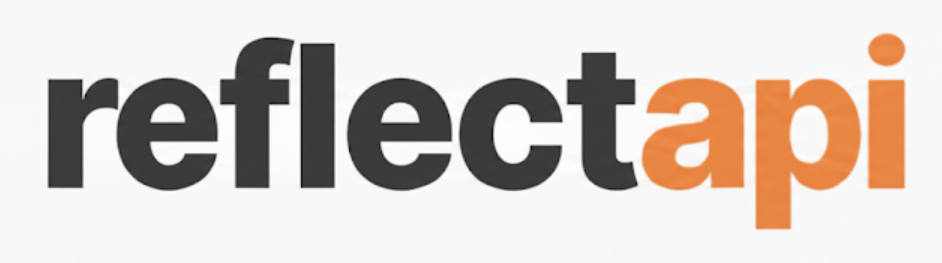

<div align="center">
  
</div>

<div align="center">
  <a href="https://crates.io/crates/reflectapi">
    
  </a>
  <a href="https://docs.rs/reflectapi">
    
  </a>
  <a href="https://github.com/thepartly/reflectapi/blob/main/LICENSE">
    
  </a>
</div>

<br>

`reflectapi` is a library and a toolkit for writing web API services in Rust and generating compatible clients, delivering great development experience and efficiency.

## Features

- **Code-first definition of services with API over HTTP**
- **100% compatible type-safe and extensible clients** delivering same simplicity and intent of the server API
- **Multi-language client generation**:
  - TypeScript - stable
  - Rust - stable
  - Python - experimental
- **Documentation rendering** using Redoc tool
- **Web framework agnostic** with plugable Axum support included, other frameworks are possible
- **Full support for all serde attributes**
- **Full enablement for all Rust types**, including standard library, common popular crates and adding support for 3rd party and custom types is straightforward

## Documentation

- [Crates.io](https://crates.io/crates/reflectapi) - Package information and versions
- [API Documentation](https://docs.rs/reflectapi) - Complete API reference
- [User Guide](docs/src/SUMMARY.md) - Tutorials and examples (build locally with `mdbook serve` in `docs/`)
- [Architecture](docs/src/architecture.md) - System design and internals

## Development notes

### Building and running

Ensure that you have `prettier` and `rustfmt` available in your PATH for consistently formatted generated TypeScript and Rust code. Python codegen uses a bundled Ruff formatter.

To run the demo server:

```
cargo run --bin reflectapi-demo
```

To generate client in Typescript for demo server:

```
cargo run --bin reflectapi -- codegen --language typescript --schema reflectapi-demo/reflectapi.json --output reflectapi-demo/clients/typescript
```

To run the Typescript generated client. Note: requires the demo server running

```
cd reflectapi-demo/clients/typescript/
npm install
npm run start
```

To generate client in Rust for demo server:

```
cargo run --bin reflectapi -- codegen --language rust --schema reflectapi-demo/reflectapi.json --output reflectapi-demo/clients/rust/generated/src/
```

To run the Rust generated client. Note: requires the demo server running

```
cd reflectapi-demo/clients/rust/
cargo run --all-features
```


To generate client in Python for demo server:

```
cargo run --bin reflectapi -- codegen --language python --schema reflectapi-demo/reflectapi.json --output reflectapi-demo/clients/python
```

### Updating Snapshots

This project uses `insta` for snapshot testing to ensure code generation output is correct and stable. When tests fail due to snapshot mismatches:

1. Review the changes first to ensure they are expected
2. Update snapshots using one of these commands:

```bash
# Interactive review (recommended)
cargo insta review

# Auto-accept all changes (use with caution)
cargo insta accept
```

3. Re-run tests to verify they pass:

```bash
cargo test
```

### Building Documentation

```bash
# Install required tools (one-time setup)
cargo install mdbook mdbook-keeper

# Build documentation
cd docs
mdbook build

# Serve documentation locally
mdbook serve  # Opens at http://localhost:3000

# Note: mdbook-keeper automatically runs doctests during build
# The build command both generates HTML and tests code examples
```

### Releasing

Pushing a `v*` tag triggers `.github/workflows/release.yml`, which:

1. Verifies every package version matches the tag (`packaging.version` parses both Cargo SemVer and PEP 440 forms so the same tag covers both ecosystems).
2. Publishes the four Rust crates to crates.io in dependency order — `reflectapi-schema` → `reflectapi-derive` → `reflectapi` → `reflectapi-cli` — using crates.io Trusted Publishing (OIDC, no `CARGO_REGISTRY_TOKEN` secret).
3. Builds the pure-Python `reflectapi-runtime` and publishes to PyPI via Trusted Publishing.
4. Cuts a GitHub Release with auto-generated notes; tags containing `alpha`, `beta`, or `rc` are flagged as pre-releases automatically.

Both publishers run inside the `release` GitHub Environment, which is configured as a trusted publisher on each crate (crates.io) and on the `reflectapi-runtime` PyPI project.

To cut a release, bump every version in lockstep and push the matching tag. The Cargo files use SemVer (`0.18.0-alpha.1`), `reflectapi-python-runtime/pyproject.toml` and `src/reflectapi_runtime/__init__.py` use PEP 440 (`0.18.0a1`):

```fish
# 1. Bump Cargo SemVer in all four crates.
cargo release \
    --exclude reflectapi-demo \
    --exclude reflectapi-demo-client \
    --exclude reflectapi-demo-client-generated \
    minor --execute --no-publish --no-tag

# 2. Bump the Python runtime (PEP 440 form) by hand:
#    reflectapi-python-runtime/pyproject.toml         version = "..."
#    reflectapi-python-runtime/src/reflectapi_runtime/__init__.py  __version__ = "..."

# 3. Commit, tag, push:
git commit -am "chore: <version>"
git tag v<version>          # the `v` prefix is required
git push origin main v<version>
```

For pre-releases use `--prerelease alpha` (or `beta` / `rc`) on `cargo release`; the Python equivalent is `0.18.0a1`, `0.18.0b1`, `0.18.0rc1`.
