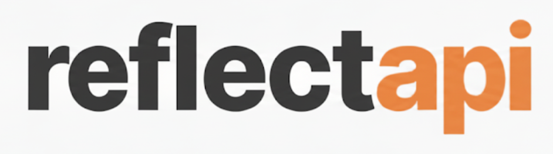

<div align="center">
  
  <br>
  
</div>

<div align="center">
  <a href="https://crates.io/crates/reflectapi">
    
  </a>
  <a href="https://docs.rs/reflectapi">
    
  </a>
  <a href="https://github.com/thepartly/reflectapi/blob/main/LICENSE">
    
  </a>
</div>

<br>

`reflectapi` is a library for Rust code-first web service API declaration and corresponding clients code generation tools.

## Features

- **Code-first API definition** using Rust types and derive macros
- **Multi-language client generation**: TypeScript, Rust, and Python
- **Type-safe** clients with IntelliSense support
- **Web framework integration** (Axum supported)

## Installation

Add `reflectapi` to your `Cargo.toml`:

```toml
[dependencies]
reflectapi = "*"
```

Or install via cargo:

```bash
cargo add reflectapi
```

## Documentation

- 📦 [Crates.io](https://crates.io/crates/reflectapi) - Package information and versions
- 📖 [API Documentation](https://docs.rs/reflectapi) - Complete API reference  
- 📚 [User Guide](https://thepartly.github.io/reflectapi/) - Tutorials and examples
- 🚀 [Quick Start](https://thepartly.github.io/reflectapi/getting-started/quick-start.html) - Get up and running in 5 minutes

### Building Documentation

```bash
# Generate and serve documentation locally
cargo install mdbook
mdbook build docs
mdbook serve docs  # Opens at http://localhost:3000

# Test documentation code examples (using mdbook-keeper)
# Note: mdbook-keeper runs tests during build, not via separate test command
mdbook build docs  # This runs all doctests with proper dependencies


```

## Demo 

### Development notes

Ensure that you have `prettier` and `rustfmt` available in your PATH to format generated code.

To run the demo server:

```
cargo run --bin reflectapi-demo
```

To generate client in Typescript for demo server:

```
cargo run --bin reflectapi -- codegen --language typescript --schema reflectapi-demo/reflectapi.json --output reflectapi-demo/clients/typescript
```

To run the Typescript generated client. Note: requires the demo server running

```
cd reflectapi-demo/clients/typescript/
npm install
npm run start
```

To generate client in Rust for demo server:

```
cargo run --bin reflectapi -- codegen --language rust --schema reflectapi-demo/reflectapi.json --output reflectapi-demo/clients/rust/generated/src/
```

To run the Rust generated client. Note: requires the demo server running

```
cd reflectapi-demo/clients/rust/
cargo run --all-features
```


To generate client in Python for demo server:

```
cargo run --bin reflectapi -- codegen --language python --schema reflectapi-demo/reflectapi.json --output reflectapi-demo/clients/python
```

### Updating Snapshots

This project uses `insta` for snapshot testing to ensure code generation output is correct and stable. When tests fail due to snapshot mismatches:

1. Review the changes first to ensure they are expected
2. Update snapshots using one of these commands:

```bash
# Interactive review (recommended)
cargo insta review

# Auto-accept all changes (use with caution)
cargo insta accept
```

3. Re-run tests to verify they pass:

```bash
cargo test
```

### Release

```
cargo release --exclude reflectapi-demo --exclude reflectapi-demo-client --exclude reflectapi-demo-client-generated minor --execute
```
